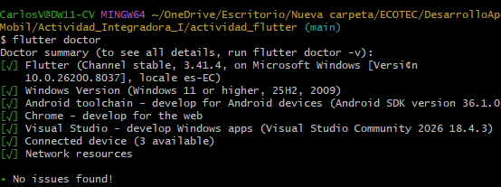
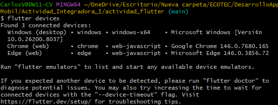
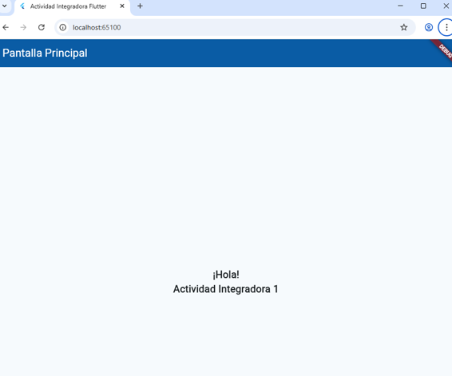
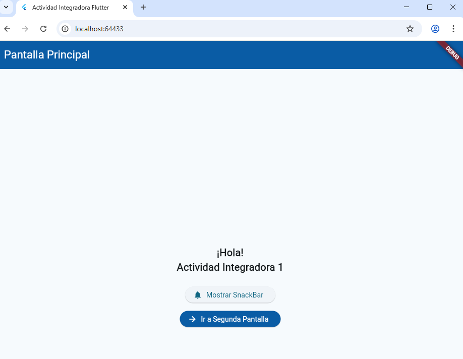
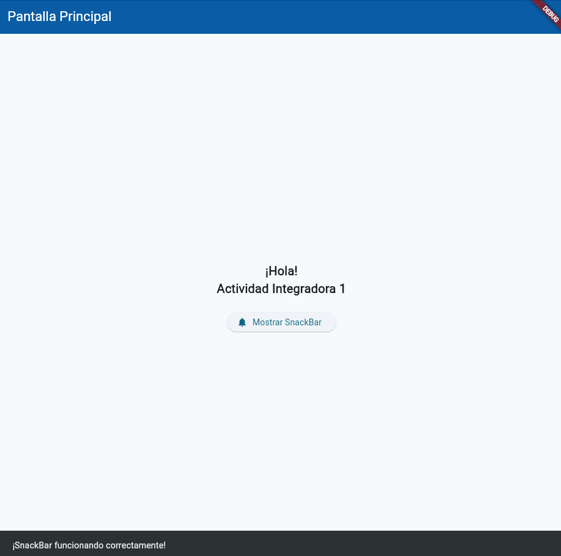
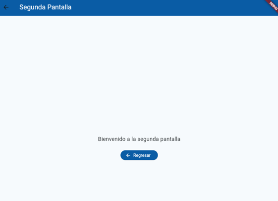

# Actividad Integradora I - Flutter

## Descripción
Aplicación desarrollada en flutter como parte de la 
Actividad integradora I del curso de desarrollo de aplicaciones móviles - ECOTEC.

Incluye:
- Modificaciones de UI (título, texto, color de AppBar)
- Botón funcional con SnackBar
- Navegación entre pantallas (Navigator.push / Navigator.pop)

## Captura

### Revisiones previas

### App

